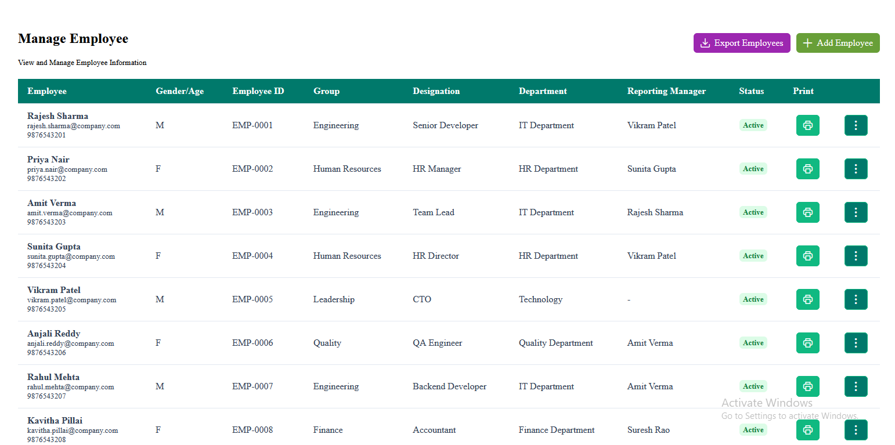
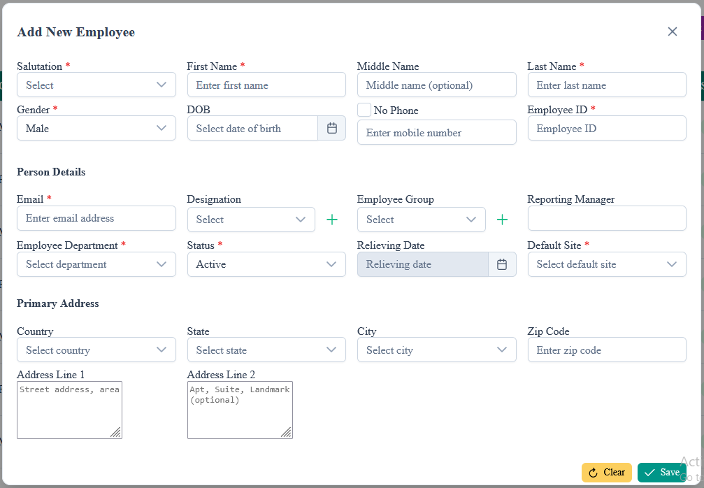
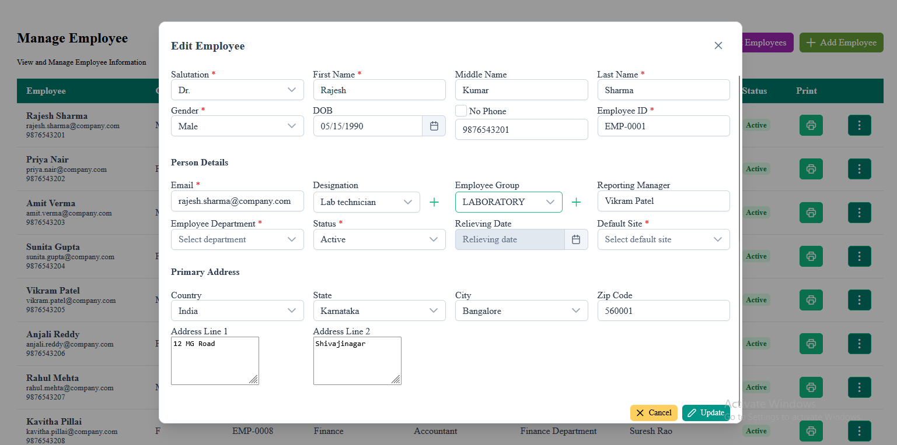
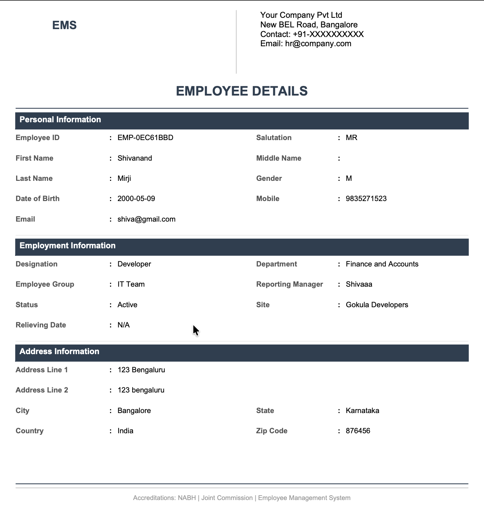
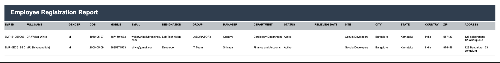

# 🏢 Employee Management System

A full-stack **Employee Management System** built with **Angular + Spring Boot + PostgreSQL**, featuring dynamic PDF report generation using **JasperReports**.

---

## 🔗 Live Demo

> 🌐 **Live Link:** [[Employee Management System](https://fullstack-employee-ms.vercel.app/)]  

---

## 📸 Screenshots

### Employee List


### Add Employee Form


### Edit Employee Form


### Individual Employee PDF Report


### All Employees Export Report


---

## 📋 Table of Contents

- [Overview](#overview)
- [Tech Stack](#tech-stack)
- [Features](#features)
- [Architecture](#architecture)
- [Project Structure](#project-structure)
- [Getting Started](#getting-started)
- [Database Setup](#database-setup)
- [API Endpoints](#api-endpoints)
- [Report Generation](#report-generation)
- [What I Learned](#what-i-learned)

---

## 📌 Overview

This project is a complete employee management solution that allows organizations to manage employee records with full CRUD operations and generate professional PDF reports. The system uses PostgreSQL database functions to optimize data fetching across multiple related tables, and Flyway for automated database migration management.

---

## 🛠️ Tech Stack

### Frontend
| Technology | Purpose |
|---|---|
| Angular 17 | SPA framework |
| PrimeNG | UI component library |
| TypeScript | Strongly typed JavaScript |
| Bootstrap Icons / PrimeIcons | Icon set |

### Backend
| Technology | Purpose |
|---|---|
| Spring Boot 4 | REST API framework |
| Spring Data JPA | ORM and repository layer |
| Hibernate | Database entity management |
| JasperReports 7 | PDF report generation |
| Flyway | Database migration & versioning |

### Database
| Technology | Purpose |
|---|---|
| PostgreSQL | Primary relational database |
| PostgreSQL Functions | Optimized data fetching via JOINs |

---

## ✅ Features

- 👥 **Employee CRUD** — Create, Read, Update, Delete employee records
- 📄 **Individual PDF Report** — Generate a detailed PDF for any single employee
- 📊 **All Employees Export** — Export all employees as a tabular PDF report
- 🔍 **Paginated Table** — Browse employees with configurable rows per page
- 🗄️ **Database Functions** — PostgreSQL functions replace complex JPA joins for better performance
- 🚀 **Flyway Migrations** — DB functions and seed data run automatically on startup
- 🔗 **Relational Data Model** — Person → PersonDetails + Address (OneToOne relationships)

---

## 🏗️ Architecture

```
Angular Frontend
    ↓ HTTP Requests
Spring Boot REST API
    ↓
Service Layer
    ↓                          ↓
PersonService            JasperReportService
    ↓                          ↓
PersonRepository         PostgreSQL Connection
    ↓                          ↓
PostgreSQL Function      JasperReports Engine
    ↓                          ↓
3 Tables Joined          PDF Generated
(person +                      ↓
 person_details +        Returned to Browser
 address)
```

### Data Flow for PDF Generation
```
Print Button (Angular)
    ↓
GET /api/employees/report/{employeeId}
    ↓
JasperReportService.generateEmployeeReport()
    ↓
PersonService.getEmployeeById()
    ↓
PersonRepository → get_employee_by_id() [DB Function]
    ↓
PostgreSQL JOIN (person + person_details + address)
    ↓
EmployeeReportProjection → EmployeeReportDTO
    ↓
JasperReports fills JRXML template with params
    ↓
PDF bytes returned → Angular downloads file
```

---

## 📁 Project Structure

```
employee-management-system/
├── Back-End/
│   └── Employee-MNG/
│       └── src/main/
│           ├── java/com/example/demo/
│           │   ├── Controller/
│           │   │   ├── PersonController.java
│           │   │   └── ReportController.java
│           │   ├── config/
│           │   │   └── FlywayConfig.java
│           │   ├── dto/
│           │   │   ├── EmployeeReportDTO.java
│           │   │   ├── EmployeeReportProjection.java
│           │   │   └── PersonRequestDTO.java
│           │   ├── model/
│           │   │   ├── Person.java
│           │   │   ├── PersonDetails.java
│           │   │   └── Address.java
│           │   ├── Repository/
│           │   │   └── PersonRepository.java
│           │   └── service/
│           │       ├── PersonService.java
│           │       ├── PersonServiceIMPL.java
│           │       └── JasperReportService.java
│           └── resources/
│               ├── db/migration/
│               │   ├── V2__create_functions.sql
│               │   └── V3__seed_data.sql
│               ├── reports/
│               │   ├── IndividualEmployee.jrxml
│               │   └── EmployeeIndividual.jrxml
│               └── application.properties
└── Front-End/
    └── src/app/
        ├── components/
        │   ├── employee-list/
        │   ├── employee-form/
        │   └── ...
        └── services/
            └── employee.service.ts
```

---

## 🚀 Getting Started

### Prerequisites

- Java 17+
- Node.js 18+
- PostgreSQL 14+
- Maven 3.8+
- Angular CLI 17+

---

### Backend Setup

**1. Clone the repository**
```bash
git clone https://github.com/yourusername/employee-management-system.git
cd employee-management-system/Back-End/Employee-MNG
```

**2. Create PostgreSQL database**
```sql
CREATE DATABASE employees_db;
```

**3. Configure `application.properties`**
```properties
spring.datasource.url=jdbc:postgresql://localhost:5432/employees_db
spring.datasource.username=your_username
spring.datasource.password=your_password

spring.flyway.enabled=false
spring.jpa.hibernate.ddl-auto=update
spring.jpa.show-sql=true
spring.jpa.open-in-view=false

server.port=8080
```

**4. Run the application**
```bash
mvn clean spring-boot:run
```

On startup:
- Hibernate automatically creates `person`, `person_details`, `address` tables from model classes
- Flyway automatically runs `V2__create_functions.sql` (creates DB function)
- Flyway automatically runs `V3__seed_data.sql` (inserts 100 test employees)

---

### Frontend Setup

**1. Navigate to frontend**
```bash
cd employee-management-system/Front-End
```

**2. Install dependencies**
```bash
npm install
```

**3. Run the application**
```bash
ng serve
```

Open `http://localhost:4200` in your browser.

---

## 🗄️ Database Setup

Tables are created automatically by Hibernate from the model classes. You do not need to run any SQL manually.

### Database Schema

```
person
├── employee_id (PK)
├── salutation
├── first_name
├── middle_name
├── last_name
├── gender
├── dob
└── mobile

person_details
├── id (PK)
├── employee_id (FK → person)
├── email
├── designation
├── employee_group
├── reporting_manager
├── department
├── status
├── relieving_date
└── site

address
├── id (PK)
├── employee_id (FK → person)
├── country
├── state
├── city
├── zip_code
├── address_line1
└── address_line2
```

### PostgreSQL Function (auto-created by Flyway)

```sql
CREATE OR REPLACE FUNCTION get_employee_by_id(p_employee_id VARCHAR)
RETURNS TABLE (...)
LANGUAGE sql AS $$
    SELECT p.*, pd.*, a.*
    FROM person p
    LEFT JOIN person_details pd ON p.employee_id = pd.employee_id
    LEFT JOIN address a ON p.employee_id = a.employee_id
    WHERE p.employee_id = p_employee_id;
$$;
```

---

## 📡 API Endpoints

### Employee CRUD
| Method | Endpoint | Description |
|---|---|---|
| `GET` | `/api/employees` | Get all employees |
| `GET` | `/api/employees/{id}` | Get employee by ID |
| `POST` | `/api/employees` | Create new employee |
| `PUT` | `/api/employees/{id}` | Update employee |
| `DELETE` | `/api/employees/{id}` | Delete employee |

### Reports
| Method | Endpoint | Description |
|---|---|---|
| `GET` | `/api/employees/report/{id}` | Download individual employee PDF |
| `GET` | `/api/employees/export` | Export all employees as PDF |

---

## 📄 Report Generation

### Individual Employee Report (`IndividualEmployee.jrxml`)
- Triggered by the Print button on each employee row
- Shows complete employee profile — personal details, company details, address
- Uses `JREmptyDataSource` with parameters from DB function result

### All Employees Report (`EmployeeIndividual.jrxml`)
- Triggered by the Export Employees button
- Tabular layout with all employees across multiple pages
- Uses direct JDBC connection since the report has its own SQL query

### Key implementation decisions:
- All JRXML parameters are `java.lang.String` to avoid type mismatch errors
- `onErrorType="Blank"` on all images to prevent crashes for missing images
- `EmployeeReportProjection` interface used for JPA native query mapping
- Dates converted from `LocalDate` to `String` in service layer

---

## 💡 What I Learned

| Topic | Learning |
|---|---|
| JasperReports | JRXML design, parameter mapping, version compatibility (6.x vs 7.x) |
| Spring Boot | Service architecture, JPA projections, native queries |
| PostgreSQL | Writing database functions, optimizing JOIN queries |
| Flyway | Database versioning, migration ordering, baseline strategy |
| Angular | PrimeNG components, reactive forms, HTTP blob handling for PDF download |
| Debugging | Type mismatches, null safety, CORS, classpath resource loading |

---

## 🤝 Contributing

Pull requests are welcome. For major changes, please open an issue first to discuss what you would like to change.

---

## 👤 Author

**Shivanand M**  
[LinkedIn](https://www.linkedin.com/in/shivanandmirji/) • [GitHub](https://github.com/Shivamirji36)

---

> ⭐ If you found this project helpful, please give it a star!